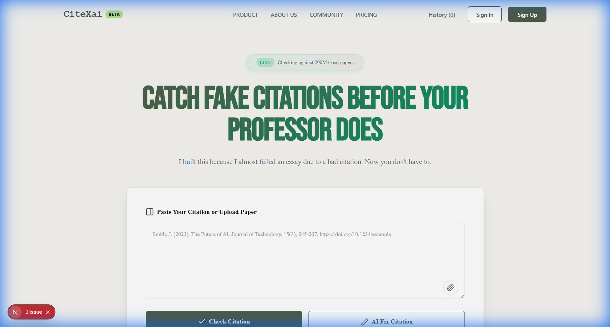

# CiteXai

**The AI Citation Guardian.**
_Verify citations. Detect fake papers. Fix broken references instantly._

## Overview

CiteXai is an advanced AI verification tool designed to combat academic dishonesty and "hallucinated" citations. In an era where AI writing tools often fabricate sources, CiteXai provides a critical layer of defense for students and researchers.

Our engine cross-references your bibliography against a verified index of over **200 million academic papers** (CrossRef, OpenAlex, PubMed) to ensure every citation is real, accurate, and properly formatted.

## Key Features

- **🛡️ Fake Citation Detection**
  Instantly spots "hallucinated" papers that sound real but don't exist.
- **✅ Real-Time Verification**
  Validates titles, authors, and DOIs against authoritative global databases.
- **🔧 Smart Auto-Fix**
  Automatically repairs broken citations by finding missing DOIs, correcting years, and fixing author names.
- **📄 PDF Extraction**
  Upload a research paper or essay to verify the entire bibliography in seconds.
- **🔄 Universal Format Converter**
  Convert citations between APA, MLA, Chicago, Harvard, and IEEE styles with one click.

## About

Built for students who want to succeed and researchers who demand accuracy.

**A product of Nexasity Ai**
_Built by **DaudX** (daudibrahimhasan)_.

## License

Distributed under the MIT License. See `LICENSE` for more information.

Copyright (c) 2026 **daudibrahimhasan**.
